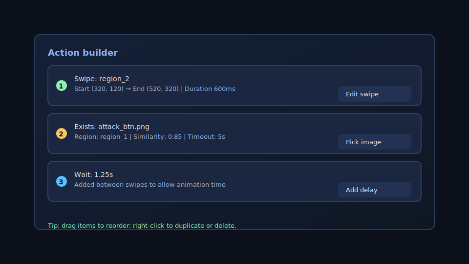

# Region & Swipe Designer (Zom-Mation)

A PyQt6 desktop tool for designing screen regions, swipes, and action scripts for AnkuLua/ZomBroX automations. Use it to mock phone screens, capture snapshots, build action sequences, and export ready-to-run Lua or JSON payloads.

## Features
- **Canvas-driven design**: Set custom screen resolutions, load background images, and visually position swipe start/end points.
- **Region management**: Start from sensible presets, add/delete custom regions, and toggle click constraints per region.
- **Snapshot tooling**: Capture selections or regions, save them to a configurable snapshots folder, and reuse the most recent capture.
- **Action builder**: Assemble ordered actions (clicks, waits, swipes, image checks, logs, key events) with similarity thresholds, timeouts, and region targeting.
- **Color tools**: Pick colors via dialog or canvas eyedropper, with clipboard-friendly hex/RGB output and preview.
- **Theming & zoom**: Switch between light/dark themes, fit-to-view, and zoom with a slider or mouse wheel; pan via right-click drag.
- **Exports**: Generate Lua (`clickimage`, `exists`, `swipe`, `wait`, etc.) or JSON outputs matching the ZomBroX format.

## Requirements
- Python 3.9+
- [PyQt6](https://pypi.org/project/PyQt6/)

Install dependencies with:

```bash
pip install PyQt6
```

## Usage
1. Launch the app:
   ```bash
   python Zom-Mation.py
   ```
2. Set your screen width/height and click **Set**.
3. (Optional) Load a background image to trace against.
4. Create or select a region, then place swipe start/end points on the canvas. Use right-click drag to pan and the mouse wheel to zoom.
5. Add actions from the left panel (clicks, swipes, waits, etc.), reordering as needed.
6. Capture snapshots or use the color picker when building image-driven actions.
7. Export the sequence via **Export Lua** or **Export JSON**.

Snapshots are stored in a `snapshots/` directory next to the script by default.

## Screenshots
- Main canvas with regions and swipe handles:
  
  
- Action builder stack with configured swipe, exists, and wait items:
  
  

## Notes
- The app remembers custom regions when changing resolution and includes them in exports.
- Press **Reset All** to return to default resolution and clear actions/backgrounds.
